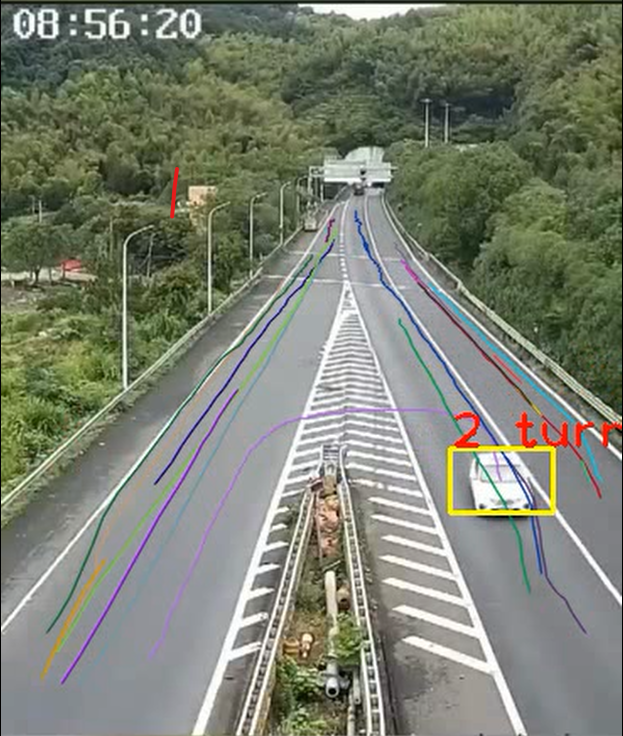

车辆非法掉头检测

[YOLOX](https://github.com/Megvii-BaseDetection/YOLOX)+
[ByteTrack](https://github.com/ifzhang/ByteTrack)+
Trajectory Analysis

## Intro
YOLOX原模型用于目标检测，ByteTrack用于关联目标，最后进行简单轨迹分析来预测车辆是否掉头。  
A simple extension of YOLOX and ByteTrack. Use YOLOX model for vehicle(car, bus, truck) detection, ByteTrack for association. And a simple trajectory analysis is used for 'u-turn' detection.

## Tracking Demo



## Installation
refer to [YOLOX](https://github.com/Megvii-BaseDetection/YOLOX)

## Model Weights
[yolox_m](https://github.com/Megvii-BaseDetection/YOLOX/releases/download/0.1.1rc0/yolox_m.pth)

## Video
[original video](https://pan.baidu.com/s/1RGBlPMkfOZGrxbT70ZbWrA?pwd=zljm)  
[results](https://pan.baidu.com/s/1cNt-xzC2q-mz6qzjZqfJ5g?pwd=a56p)

## Demo
```shell
python tools/demo_vehicle_track.py video -f exps/example/yolox_m_vehicle_det.py -c ./pretrained/yolox_m.pth --path ./videos/test_13.mp4 --conf 0.25 --nms 0.45 --tsize 640 --save_result --device gpu
```

## Track other objects (CoCo dataset, 80 classes)
pls modify
```shell
./exps/example/yolox_m_vehicle_det.py  # self.track_classes
```
